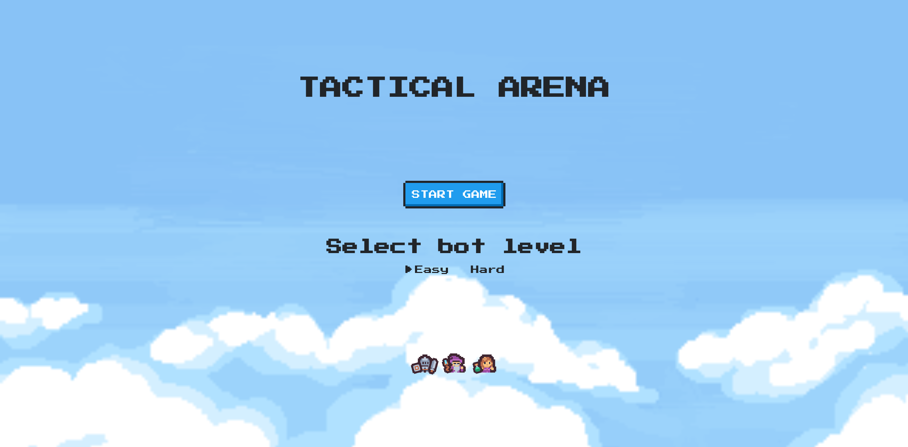

# TACTICAL ARENA - Rules

## Overview
Tactical Arena is a turn-based strategy game where two teams — **Player** and **Bot** — compete to achieve victory by either eliminating all opponents or controlling the **Target Area** for consecutive turns.



Each team controls a set of heroes with different roles:
- **Warrior** – High damage and health.
- **Wizard** – Ranged magic attacks.
- **Medic** – Healer, can restore health to allies.

The game is played on a grid-based map.

---

## Game Objectives
A team can win by fulfilling **one of the following conditions**:

1. **Eliminate all enemy heroes**.
2. **Control the Target Area** for **5 consecutive turns**.

---

## Heroes & Abilities

| Hero Type | Max Health | Special Ability                | Damage/Heal | Ranges |
|-----------|------------|--------------------------------|-------------|--------|
| Warrior   | 1000       | Melee attack                  | 300         | 1      |
| Wizard    | 400        | Ranged attack                 | 150         | 4      |
| Medic     | 600        | Heal ally                     | 100         | 4      |

---

## Turn Mechanics
1. Teams take turns moving and performing actions.
2. Each hero can perform one action per turn:
    - **Move** to an adjacent tile.
    - **Attack** an enemy within range (Optional: if player have available action to do).
    - **Heal** an ally (Optional: if player have available action to do).

---

## Target Area Rules
- The **Target Area** is a designated zone on the map (defined by coordinates).
- Teams score **consecutive turns** when one or more heroes occupy the area:
    - If **both teams** occupy the area simultaneously, no counter increments.
    - Only the team exclusively in the area increments its counter.
- **Victory is achieved** when a team controls the target area for **5 consecutive turns**.

---

## Winning the Game
A team wins when **either condition** is met:

1. **Eliminating all enemies** – all opposing heroes have 0 HP.
2. **Target Area Victory** – the team controls the target area for **5 consecutive turns**.

---

# Tactical Arena - Implementation

This repository contains the **Tactical Arena** project, consisting of a Clojure/ClojureScript backend and frontend.

- **Backend:** `ta_backend` (Clojure)
- **Frontend:** `ta_frontend` (ClojureScript with Shadow CLJS)

---

## Prerequisites

Make sure you have the following installed:

- [Java JDK 11+](https://adoptium.net/)
- [Leiningen](https://leiningen.org/) for Clojure projects
- [Node.js 18+](https://nodejs.org/) for frontend dependencies
- [npm or yarn](https://www.npmjs.com/) package manager

---

## Backend (`ta_backend`)

### 1. Navigate to backend

```bash
cd ta_backend
```

### 2. Get dependencies

```bash
lein deps
```

### 3. Run the backend server

```bash
lein run
```

You should see logs similar to:
````
INFO [ta-backend.logger:13] - Server started on http://localhost:8080
INFO [ta-backend.logger:13] - Swagger documentation is placed on http://localhost:8080/api-docs/index.html
````

API Base URL: http://localhost:8080

Swagger documentation: http://localhost:8080/api-docs/index.html

### 4. Run backend tests

```bash
lein midje
```

All tests are located under test/ folder.

---

## Frontend (ta_frontend)

### 1. Navigate to frontend

```bash
cd ta_frontend
```

### 2. Get dependencies

```bash
npm install
# or
yarn install
```

### 3. Start the frontend development server

```bash
npx shadow-cljs watch app
```

This will compile ClojureScript and watch for changes. Open your browser at:

````
http://localhost:3000
````

Note: Ensure the backend server is running at http://localhost:8080 for API calls.

### 4. Build frontend for production

```bash
npx shadow-cljs release app
```

The build output will be in public/js/.
